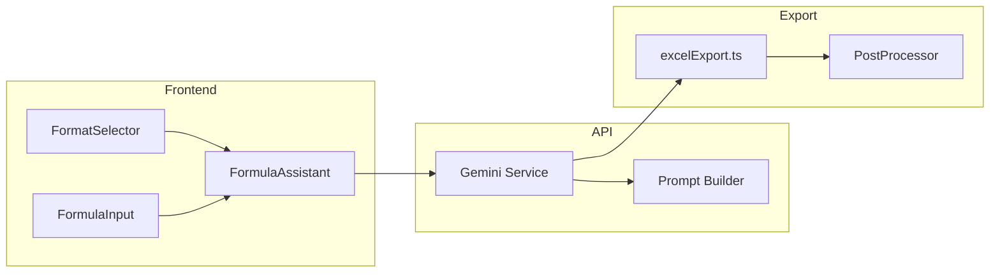

# Conception : Choix du format de formule (Excel/LibreOffice × EN/FR)

## Résumé

Remplacer la logique actuelle de traduction FR→EN des formules par un sélecteur de format explicite (4 cibles) qui pilote à la fois le prompt IA et les ajustements de l'export Excel.

## Contexte

Actuellement, le flux est :
1. L'utilisateur pose une question en français
2. L'IA génère une formule en français (SI, RECHERCHEV, ;)
3. Une fonction `translateFrenchFormulaToEnglish()` convertit en anglais
4. Des correctifs ad-hoc gèrent les cas particuliers (FAUX→FALSE, * manquant)

Problèmes :
- La traduction FR→EN est fragile et incomplète
- LibreOffice Calc ne reconnaît pas `XLOOKUP` dans le XML OOXML
- Les formats français (`,`, `;`) et anglais (`.`, `,`) sont mélangés
- Chaque nouveau cas nécessite un fix ponctuel

Solution : laisser l'utilisateur choisir sa cible **avant** la génération, et adapter l'IA + l'export en conséquence.

## Architecture

### Flux de données

```
[UI] FormatSelector → choix utilisateur (excel-en | excel-fr | libreoffice-en | libreoffice-fr)
     ↓
[API /gemini] prompt système → section [FORMAT] injectée dynamiquement
     ↓ (streaming)
[IA] génère la formule directement dans le format demandé
     ↓
[extraction] parse la réponse markdown → extrait la formule
     ↓
[post-traitement] conversions minimales propres au format (XLOOKUP→INDEX+MATCH pour LO)
     ↓
[Excel Export] applique les ajustements finaux (cache, fullCalcOnLoad)
     ↓
[.xlsx] fichier prêt pour la cible choisie
```

### Diagramme de composants



## Formats supportés

| Format | Fonctions | Séparateur args | Décimales | Cache result | XLOOKUP |
|---|---|---|---|---|---|
| `excel-en` | IF, VLOOKUP, PMT | `,` | `.` | Oui | OK |
| `excel-fr` | SI, RECHERCHEV, VPM | `;` | `,` | Oui | OK |
| `libreoffice-en` | IF, VLOOKUP, PMT | `,` | `.` | Non | INDEX+MATCH |
| `libreoffice-fr` | SI, RECHERCHEV, VPM | `;` | `,` | Non | INDEX+EQUIV |

## Modifications détaillées

### 1. Type ExportFormat

```typescript
// Nouveau type partagé
type ExportFormat = "excel-en" | "excel-fr" | "libreoffice-en" | "libreoffice-fr";
```

### 2. UI : FormulaAssistant.tsx

- Ajouter un `<select>` avec les 4 options, **au-dessus de la zone de prompt**
- Valeur par défaut : `"libreoffice-fr"`
- Stocké dans `useState` + persisté dans `localStorage` (clé : `excel-export-format`)
- Le format est passé à la fois :
  - À la requête API (`POST /api/gemini`)
  - À la fonction d'export (`downloadFormulaAsExcel`)

### 3. Prompt IA : src/lib/gemini/prompt.ts

La fonction qui construit le prompt système reçoit `format: ExportFormat` et injecte un bloc conditionnel :

```
## Format de formule demandé : [FORMAT]
- Noms de fonctions : [EN: IF, VLOOKUP, PMT / FR: SI, RECHERCHEV, VPM]
- Séparateur d'arguments : [',' / ';']
- Séparateur décimal : ['.' / ',']
- N'utilise PAS XLOOKUP, XMATCH, RECHERCHEX ni EQUIVX [pour formats LibreOffice]
  Utilise INDEX + MATCH / INDEX + EQUIV à la place
```

Le bloc est positionné juste après les instructions générales, avant la section "Règles de calcul".

### 4. Extraction de formule : src/lib/gemini/extractFormula.ts

- Inchangé : l'extraction parse le dernier bloc de code dans la réponse
- La formule est déjà dans le bon format (générée par l'IA)

### 5. Post-traitement : nouveau fichier src/lib/excelExport/postProcessFormula.ts

Pour les formats LibreOffice uniquement :

```typescript
function postProcessFormula(formula: string, format: ExportFormat): string {
  if (format === "libreoffice-en") {
    // XLOOKUP → INDEX + MATCH
    formula = convertXlookupToIndexMatch(formula);
  }
  if (format === "libreoffice-fr") {
    // RECHERCHEX → INDEX + EQUIV
    formula = convertRecherchexToIndexEquiv(formula);
  }
  return formula;
}
```

Règles de conversion :
- **3 paramètres** : `XLOOKUP(A1, B:B, C:C)` → `INDEX(C:C, MATCH(A1, B:B, 0))`
- **4 paramètres (not found)** : `XLOOKUP(A1, B:B, C:C, "NF")` → `IFERROR(INDEX(C:C, MATCH(A1, B:B, 0)), "NF")`
- **5+ paramètres** (match_mode, search_mode) : laisser tel quel (trop complexe), l'utilisateur verra l'erreur
- Même logique pour les versions françaises avec `;`

### 6. Export Excel : src/lib/excelExport.ts

La fonction `downloadFormulaAsExcel` reçoit `format: ExportFormat` :

```typescript
async function downloadFormulaAsExcel(data, format: ExportFormat) {
  const workbook = new ExcelJS.Workbook();
  // ... setup existant ...

  // 1. Toujours activer fullCalcOnLoad
  workbook.calcProperties.fullCalcOnLoad = true;

  // 2. Extraire la formule
  let formula = extractFormulaFromMarkdown(data.response);

  // 3. Post-traitement spécifique au format
  formula = postProcessFormula(formula, format);

  // 4. Assigner à la cellule
  const resCell = resultRowSim.getCell(3);
  resCell.value = { formula: formula.replace(/^=/, "") };

  // 5. Cache result côté client
  if (format.startsWith("excel-")) {
    // Calcul optionnel du cache
  }

  // 6. Générer le buffer
  const buffer = await workbook.xlsx.writeBuffer();
  // ...
}
```

### 7. Nettoyage : suppression de code

- Supprimer `translateFrenchFormulaToEnglish()` et toutes les références
- Supprimer les dictionnaires de traduction (`FR_EN_MAP`)
- Supprimer la regex de correction `*` manquant (plus nécessaire — l'IA génère correctement)
- Supprimer les fichiers/utilitaires de traduction devenus inutiles

## Cas limites

| Cas | Gestion |
|---|---|
| L'IA ignore le format demandé | Post-traitement valide le séparateur. Si mismatch, log warning mais utilisation quand même |
| XLOOKUP complexe (5+ paramètres) | Laissé tel quel — pas de conversion automatique |
| Anciennes sessions (messages historiques) | Le format ne s'applique qu'aux nouvelles réponses |
| Formule sans préfixe `=` | Le `.replace(/^=/, "")` protège contre les deux cas |
| Décimales mal formatées | L'IA est censée suivre les instructions. Si erreur, visible par l'utilisateur |

## Non-couvert (hors scope)

- Édition de formule après génération
- Support d'autres locales (allemand, espagnol, etc.)
- Conversion INDEX+MATCH→XLOOKUP (sens inverse)

## Tests

### Tests manuels (à exécuter avant validation)

1. **excel-en** : ouvrir dans Excel → formules en anglais, `,`, `.`, résultats calculés
2. **excel-fr** : ouvrir dans Excel → formules en français, `;`, `,`, résultats calculés
3. **libreoffice-en** : ouvrir dans LO → formules en anglais, `,`, `.`, pas d'erreur
4. **libreoffice-fr** : ouvrir dans LO → formules en français, `;`, `,`, pas d'erreur
5. **XLOOKUP LO-EN** : générer avec XLOOKUP → converti en INDEX+MATCH
6. **RECHERCHEX LO-FR** : générer avec RECHERCHEX → converti en INDEX+EQUIV
7. **Persistance** : changer de format, rafraîchir → le choix est conservé

### Tests régressions

- VPM (PMT) fonctionne dans les 4 formats
- SI imbriqués (nested IF) fonctionnent
- RECHERCHEV avec FAUX/FALSE fonctionne
- Pas d'`Err:508` dans aucun format

## Plan d'implémentation

1. Créer le type `ExportFormat`
2. Ajouter le `<select>` dans l'UI + localStorage
3. Modifier le prompt builder pour injecter le format
4. Créer le post-processeur XLOOKUP→INDEX+MATCH
5. Modifier `downloadFormulaAsExcel` pour accepter et utiliser le format
6. Supprimer l'ancienne logique de traduction
7. Tester les 4 formats
